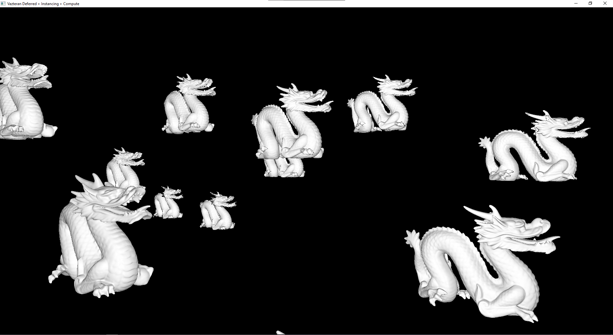

# Vazteran

Vulkan based library for learning purposes. Its main goal is to offer a base interface
for my personal projects in computer graphics. 

Here is the roadmap :
| Feature                                                         | Progress  |
|-----------------------------------------------------------------|-----------|
| Window                                                          | Done      |
| Base Vulkan wrapper                                             | Done      |
| Render graph                                                    | Done      |
| Instancing                                                      | Done      |
| Compute shader                                                  | Done      |
| Indirect rendering                                              | Done      |
| Raytracing extension                                            | Done      |
| Real test with larger application                               | WIP (See [Launcher of Particle](https://github.com/PlathC/LauncherOfParticle)) |

## Current state

The render graph allows to easily define various passes as presented in the `app/deferred` sample.



## Build 

To clone the project and its dependencies:
```
git clone --recurse-submodules -j8 https://github.com/PlathC/Vazteran.git
```

Most of the dependencies are embedded but you must install Python3 and Vulkan SDK on your own.

The project uses CMake, to build it you may use the following command or any IDE supporting it:
```
cd Vazteran
mkdir build && cd build
cmake ..
cmake --build . --target Vazteran --config Release
```


## Samples 

The large majority of the samples are coming from [Morgan McGuire's samples libary](https://casual-effects.com/data/).

- [The Crounching Boy Open source model by SMK - Statens Museum for Kunst Creative Commons Attribution 4.0 International License](https://www.myminifactory.com/object/3d-print-the-crouching-boy-104413)
- [Mori Knob Open source model by Yasutoshi "Mirage" Mori Creative Commons Attribution 4.0 International License](https://github.com/lighttransport/lighttransportequation-orb)
- [Viking Room Open source model by nigelgoh Creative Commons Attribution 4.0 International License](https://sketchfab.com/3d-models/viking-room-a49f1b8e4f5c4ecf9e1fe7d81915ad38)
- [Bunny scan by Greg Turk and Marc Levoy](https://faculty.cc.gatech.edu/~turk/bunny/bunny.html)
