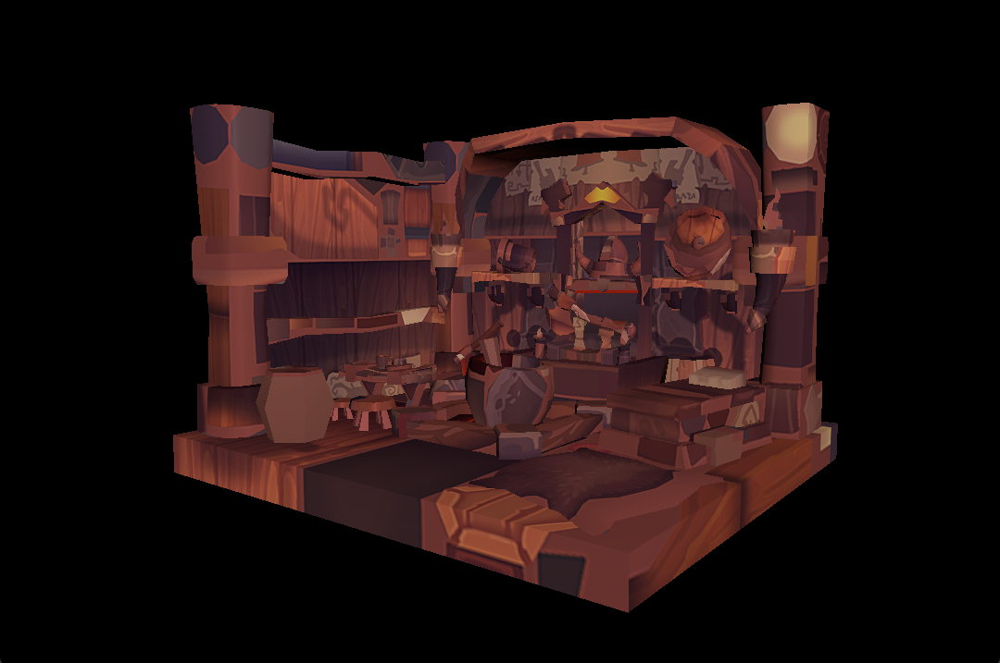
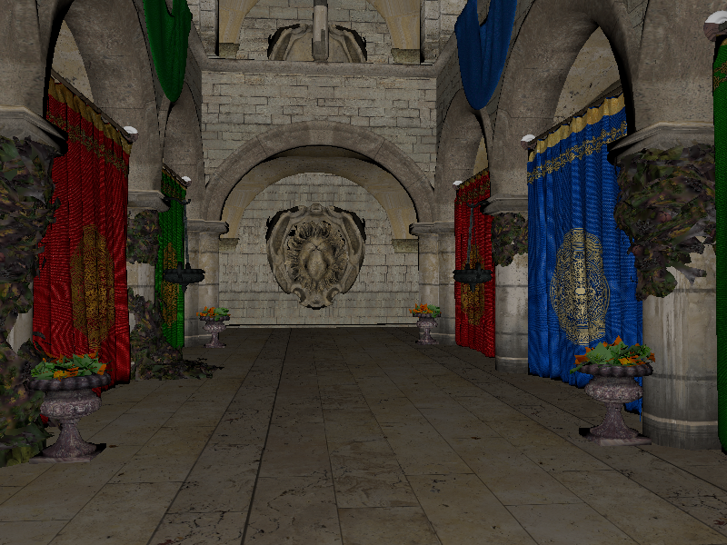

# Vazteran

Vulkan based viewer for learning purposes. This aims to make available a simple but configurable and accurate way 
to render my potential future test related to computer graphics. 

| Feature                                                         | Progress  |
|-----------------------------------------------------------------|-----------|
| Razterization (Vulkan)                                          | Done      |
| Phong                                                           | WIP       |
| PBR                                                             | To do     |
| Path tracing                                                    | To do     |

## Current state

The engine can now load 3D models and present it with an hardcoded phong that will be extended in order to use uniform data.

## Samples 

- [The Crounching Boy](https://www.myminifactory.com/object/3d-print-the-crouching-boy-104413)
- [Sponza by Marko Dabrovic](http://hdri.cgtechniques.com/~sponza/files/)